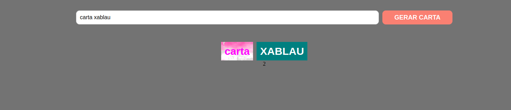

# project-mistery-letter

## Sobre o Projeto

Projeto que realizei na [Trybe](https://github.com/tryber), seu objetivo era criar uma aplicação onde a pessoa usuária digita um texto e a partir deste texto será gerado uma carta misteriosa, tem também como objetivo promover a busca por novos conhecimentos.

## Construido Com:
 1. **HTML**
 3. **CSS**
 4. **JavaScript**
 5. **DOM**

## Uso

A pessoa usuária digita uma carta no campo de texto, depois clica no botão "GERAR CARTA", assim uma carta vai ser criada com estilos aleatórios.

## Contato

Renan Fernandes - [Linkedin](https://www.linkedin.com/in/orenanfernandes/)
